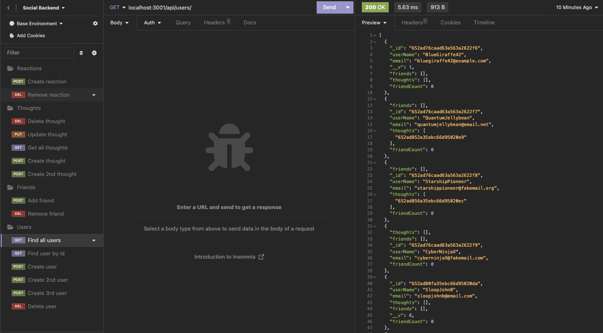

# Social Network API

  

  ## Description
  The Social Network API provide backend functionality for a social network application. As a developer I want a ready made backend utilizing MondgoDB to easily implement into my new social network application.
  
  ## Table of Contents
  1. [Installation](#Installation)
  2. [Usage](#usage)
  3. [License](#license)
  4. [Contribute](#contribute)
  5. [Tests](#tests)
  6. [Questions](#questions)
  
  ## Installation
  No installation necessary. Just run NPM start from the command line to start the server.
  
  ## Usage
  The Social Network API provides functionality for adding, deleting, and updating users. It adds functionality for adding thoughts, updating thoughts and deleting thoughts. Finally it adds functionality for adding and deleting comments to thoughts.

  
  
  ## License
  This software is not covered under any license.
  
  
  
  ## How to Contribute
  N/A
  
  ## Tests
  N/A
  
  ## Questions
  Github: https://github.com/bklein1981
  
  Video Link: https://drive.google.com/file/d/1Auy-3EuEQMKmomrEkM2J-Z_1_MY3rR6n/view
